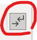

# MS Word 2021 문서 작성하기
## 빈 문서에서 보고서·제안서를 시작할 때 초기 설정 Best Practice

회사에서 Word 문서를 작성할 때 대부분은 기존 문서를 복사해서 수정한다.  
하지만 참고할 만한 양식이 없거나, 양식을 찾을 시간도 없이 처음부터 보고서나 제안서를 만들어야 할 때가 있다.

문제는 이런 일이 자주 있는 것이 아니다 보니 매번 다음과 같은 것부터 다시 찾아보게 된다는 점이다.

- A4 용지는 어디서 설정하지?
- 여백은 어느 정도가 적당하지?
- 기본 글꼴과 줄 간격은 어떻게 설정하지?
- 제목은 그냥 글자 크기만 키우면 되나?
- 페이지 번호는 어디서 넣지?
- 목차는 어떻게 자동으로 만들지?

이 문서는 **Microsoft Word 2021을 처음 사용하는 사람도 빈 문서에서 기본적인 업무용 보고서나 제안서를 만들 수 있도록**, 문서를 처음 열었을 때부터 순서대로 설정하는 방법을 정리한다.

> 이 글의 목적은 화려한 Word 편집 기술을 소개하는 것이 아니다.  
> **양식이 전혀 없는 상태에서 수정하기 쉽고 잘 깨지지 않는 업무용 Word 문서를 빠르게 만드는 것**이 목적이다.

---

# 1. 새 문서 만들기

Word 2021을 실행한다.

1. **파일**을 클릭한다.
2. **새로 만들기**를 선택한다.
3. **빈 문서**를 클릭한다.

아무 내용도 없는 새 Word 문서가 열린다.

---

# 2. 용지 크기를 A4로 설정

보고서나 제안서를 작성하기 전에 가장 먼저 문서의 용지 크기를 정한다.

1. 상단 메뉴에서 **레이아웃**을 클릭한다.
2. **크기**를 클릭한다.
3. 목록에서 **A4 (210 × 297 mm)** 를 선택한다.

일반적인 국내 업무용 보고서나 제안서는 특별한 이유가 없다면 A4로 시작하면 된다.

---

## 2-1. `레이아웃 → 크기`에 A4가 보이지 않는 경우

Word의 용지 크기 목록은 Word가 독립적으로 가지고 있는 것이 아니라 **현재 선택된 프린터와 프린터 드라이버의 영향을 받는다.**

따라서 `레이아웃 → 크기`에 A4가 없거나 용지 종류가 몇 개밖에 표시되지 않는다면 Word를 다시 설치하기 전에 **현재 선택된 프린터를 먼저 확인**하는 것이 좋다.

Microsoft에서도 프린터가 변경되면 Word가 새 프린터 드라이버에서 페이지 크기 등의 용지 설정을 다시 가져오는 동작이라고 설명한다.

### 가장 먼저 해볼 방법

1. Word 상단에서 **파일**을 클릭한다.
2. **인쇄**를 클릭한다.
3. 현재 선택되어 있는 **프린터**를 확인한다.
4. 프린터가 다음과 같이 특수한 장치로 되어 있다면 다른 프린터로 변경해 본다.
   - OneNote
   - Fax
   - 특정 가상 프린터
   - 현재 사용할 수 없는 프린터
5. 가능하면 실제 설치된 프린터나 **Microsoft Print to PDF** 같은 다른 프린터를 선택한다.
6. 다시 문서 화면으로 돌아온다.
7. **레이아웃 → 크기**를 클릭한다.
8. **A4**가 나타났는지 확인한다.

Microsoft Q&A에도 Word의 용지 형식이 프린터 드라이버에 의해 정의되며, `파일 → 인쇄`에서 OneNote 대신 `Microsoft Print to PDF`로 프린터를 변경한 뒤 원하는 용지 크기가 표시된 사례가 소개되어 있다.

### 그래도 A4가 나타나지 않는 경우

실제 사용하는 프린터의 기본 용지 설정도 확인한다.

Windows 10 기준:

1. Word를 종료한다.
2. Windows **시작 → 설정**을 연다.
3. **장치**를 선택한다.
4. **프린터 및 스캐너**를 선택한다.
5. 사용할 프린터를 선택한다.
6. **관리**를 클릭한다.
7. **인쇄 기본 설정** 또는 **프린터 속성**을 연다.
8. `Paper Size`, `Document Size`, `용지 크기` 등으로 표시된 항목을 찾는다.
9. **A4**로 설정한다.
10. Word를 다시 실행한다.
11. **레이아웃 → 크기**에서 A4가 나타나는지 확인한다.

> 핵심  
> `레이아웃 → 크기`에 A4가 없다고 해서 Word의 A4 기능이 사라진 것은 아니다.  
> **현재 선택된 프린터 또는 프린터 드라이버에서 Word가 올바른 용지 정보를 가져오지 못하고 있는지 먼저 확인한다.**

---

# 3. 용지 방향을 세로로 설정

일반적인 보고서나 제안서는 세로 방향을 사용한다.

1. 상단 메뉴에서 **레이아웃**을 클릭한다.
2. **방향**을 클릭한다.
3. **세로**를 선택한다.

넓은 표나 가로로 긴 도표를 사용해야 하는 경우에만 가로 방향을 고려한다.

---

# 4. 페이지 여백 설정

기본 여백을 그대로 사용해도 문서를 작성할 수 있지만, 처음부터 업무용 문서의 기본값을 정해두는 편이 좋다.

1. **레이아웃**을 클릭한다.
2. **여백**을 클릭한다.
3. **사용자 지정 여백**을 선택한다.

예를 들어 다음과 같이 설정한다.

| 항목 | 권장 시작값 |
|---|---:|
| 위쪽 | 20 mm |
| 아래쪽 | 20 mm |
| 왼쪽 | 25 mm |
| 오른쪽 | 25 mm |

설정한 뒤 **확인**을 클릭한다.

특별한 사내 문서 규정이 없다면 이 정도에서 시작하면 무난하다.

단순한 내부 보고서라면 좌우 여백을 20 mm로 사용해도 된다.

---

# 5. 기본 글꼴과 글자 크기 설정

문서를 작성하면서 매번 글꼴을 바꾸지 않으려면 기본 글꼴부터 정한다.

1. 상단에서 **홈**을 클릭한다.
2. `글꼴` 영역 오른쪽 아래에 있는 **작은 화살표**를 클릭한다.
3. `글꼴` 창에서 `한글 글꼴`, `글꼴`, 글꼴 스타일, 크기를 지정한다.

Word 2021 한국어 버전에서는 `한글 글꼴`과 `글꼴`이 따로 보일 수 있다.

- **한글 글꼴**: 한글 문자에 적용되는 글꼴
- **글꼴**: 영문, 숫자, 기호 등에 적용되는 글꼴

업무용 한글 문서라면 둘을 같은 글꼴로 맞추는 것이 가장 무난하다.

예:

- 한글 글꼴: **맑은 고딕**
- 글꼴: **맑은 고딕**
- 글꼴 스타일: **보통**
- 크기: **10pt 또는 10.5pt**

이렇게 설정하면 한글뿐 아니라 영문과 숫자도 같은 계열의 글꼴로 표시되어 문서 전체의 인상이 통일된다.

설정 후 필요하면 **기본값으로 설정**을 클릭한다.

Word에서 적용 범위를 묻는다면 처음에는 다음을 권장한다.

- **이 문서만**

`Normal.dotm 서식 파일을 사용하는 모든 문서`를 선택하면 이후 새로 만드는 Word 문서에도 영향을 줄 수 있으므로 Word를 처음 사용하는 경우에는 굳이 변경하지 않는 것이 안전하다.

---

# 6. 본문의 줄 간격과 문단 간격 설정

글꼴 다음으로 문서 인상을 크게 좌우하는 것이 문단 간격이다.

1. **홈**을 클릭한다.
2. `단락` 영역 오른쪽 아래의 **작은 화살표**를 클릭한다.
3. `단락` 창에서 다음과 같이 설정한다.

예:

| 항목 | 권장 시작값 |
|---|---:|
| 맞춤 | 왼쪽 |
| 왼쪽 들여쓰기 | 0 |
| 오른쪽 들여쓰기 | 0 |
| 문단 앞 간격 | 0pt |
| 문단 뒤 간격 | 6pt |
| 줄 간격 | 배수 |
| 값 | 1.15 |

문서 성격에 따라 줄 간격을 1.2~1.3 정도로 넓혀도 된다.

중요한 것은 **빈 줄을 만들기 위해 Enter를 여러 번 누르는 대신 문단 간격을 사용하는 것**이다.

---

# 7. 눈금자 표시하기

Word를 처음 사용할 때는 눈금자를 표시해 두는 것이 편하다.

1. 상단 메뉴에서 **보기**를 클릭한다.
2. **눈금자**에 체크한다.

문서 위쪽과 왼쪽에 눈금자가 표시된다.

눈금자를 사용하면 다음 항목을 확인하거나 조절하기 쉽다.

- 들여쓰기
- 탭 위치
- 문서 폭
- 좌우 여백의 대략적인 위치

---

# 8. 서식 기호 표시하기

문서가 이상하게 밀리거나 줄이 맞지 않을 때 원인을 찾으려면 **편집 기호**를 표시해 두는 것이 좋다.

Word 2021 한국어 버전에서는 이 기능을 `¶` 문자 모양으로 찾기보다, **홈 탭의 단락 그룹 오른쪽 위에 있는 아래 그림의 버튼**을 찾는 것이 정확하다.



위 그림에서 빨간색으로 표시된 버튼이 **편집 기호 표시/숨기기** 버튼이다.

설정 방법:

1. 상단 메뉴에서 **홈**을 클릭한다.
2. **단락** 그룹을 찾는다.
3. 단락 그룹 오른쪽 위에 있는 **편집 기호 표시/숨기기** 버튼을 클릭한다.
4. 한 번 클릭하면 편집 기호가 표시되고, 다시 클릭하면 숨겨진다.

단축키는 다음과 같다.

`Ctrl + Shift + 8`

편집 기호를 표시하면 문서에서 다음과 같은 숨은 문자를 확인할 수 있다.

- `Enter`: 새 문단을 만든 위치
- `Shift + Enter`: 같은 문단 안에서 강제로 줄만 바꾼 위치
- `Ctrl + Enter`: 페이지 나누기가 삽입된 위치
- `Space`: 입력한 공백
- `Tab`: 탭 문자

이 기능은 특히 **Enter를 여러 번 눌러 빈 공간을 만들었거나, Space를 여러 번 눌러 위치를 맞춘 부분을 찾을 때** 유용하다.

> 참고  
> 인터넷의 Word 사용법에서는 이 기능을 흔히 `¶` 버튼이라고 설명하는 경우가 있다.  
> 그러나 Word 2021 한국어 버전에서는 설치 환경과 표시 방식에 따라 실제 리본 아이콘이 위 그림처럼 보일 수 있으므로, **아이콘 그림과 위치를 기준으로 찾는 편이 확실하다.**

---

# 9. 제목 스타일 설정하기

Word 문서를 처음 작성할 때 가장 중요한 습관 중 하나다.

제목처럼 보이게 만들기 위해 매번 글자를 선택해서 크기를 키우고 굵게 만드는 것이 아니라 **Word의 스타일 기능**을 사용한다.

Word 상단에서 다음 위치를 찾는다.

**홈 → 스타일**

보통 다음 스타일이 보인다.

- 표준
- 제목
- 제목 1
- 제목 2
- 제목 3

---

## 9-1. `제목 1` 설정

1. **홈 → 스타일**로 이동한다.
2. **제목 1** 위에서 마우스 오른쪽 버튼을 클릭한다.
3. **수정**을 클릭한다.

예:

- 글꼴: 맑은 고딕
- 크기: 16pt
- 굵게

문단 간격도 함께 설정하려면:

1. 수정 창 아래의 **서식**을 클릭한다.
2. **단락**을 선택한다.
3. 예를 들어 다음과 같이 설정한다.
   - 앞 간격: 18pt
   - 뒤 간격: 8pt
4. 확인한다.

---

## 9-2. `제목 2` 설정

1. **홈 → 스타일 → 제목 2**
2. 마우스 오른쪽 버튼
3. **수정**

예:

- 크기: 13pt
- 굵게
- 앞 간격: 12pt
- 뒤 간격: 6pt

---

## 9-3. `제목 3` 설정

동일한 방법으로 설정한다.

예:

- 크기: 11pt
- 굵게
- 앞 간격: 8pt
- 뒤 간격: 4pt

---

# 10. 문서 제목 입력

문서 맨 위에 문서 제목을 입력한다.

예:

`MES 시스템 개선 제안서`

문서 전체 제목에는 `제목 1`보다 Word의 별도 **제목** 스타일을 사용하는 것이 좋다.

1. 문서 제목을 선택한다.
2. **홈 → 스타일 → 제목**을 클릭한다.

필요하면 `제목` 스타일도 마우스 오른쪽 버튼 → **수정**으로 원하는 모양을 지정한다.

---

# 11. 본문부터 쓰지 말고 문서 구조부터 작성

보고서 내용을 바로 쓰기 시작하기보다는 우선 전체 구조부터 만든다.

예:

```text
1. 개요

2. 추진 배경

3. 현황

4. 문제점

5. 개선 방안

6. 추진 일정

7. 기대 효과
```

각 항목에 **제목 1** 스타일을 적용한다.

하위 항목이 있다면:

```text
5. 개선 방안
5.1 시스템 구성
5.2 데이터 처리 방식
```

`5.1`, `5.2`에는 **제목 2**를 적용한다.

여기서 주의할 점이 있다.

**제목 2 스타일을 적용하면 Word는 해당 항목을 제목 1의 하위 제목으로 인식하지만, 화면에서 들여쓰기까지 자동으로 적용되는 것은 아니다.**

즉 제목 2를 적용했더라도 다음처럼 제목 1과 제목 2의 시작 위치가 같아 보일 수 있다.

```text
5. 개선 방안
5.1 시스템 구성
5.2 데이터 처리 방식
```

이 상태도 문서 구조상으로는 문제가 없다. 탐색 창과 자동 목차에서는 `5.1`, `5.2`가 `5. 개선 방안`의 하위 제목으로 인식된다.

화면에서도 하위 제목을 들여쓰기해서 다음처럼 보이게 하고 싶다면:

```text
5. 개선 방안
    5.1 시스템 구성
    5.2 데이터 처리 방식
```

`제목 2` 스타일의 단락 설정에서 왼쪽 들여쓰기를 지정한다.

설정 방법:

1. **홈 → 스타일**에서 **제목 2**를 찾는다.
2. **제목 2**에서 마우스 오른쪽 버튼을 클릭한다.
3. **수정**을 클릭한다.
4. 왼쪽 아래의 **서식 → 단락**을 클릭한다.
5. `들여쓰기` 항목의 **왼쪽** 값을 지정한다.
   - 예: **0.5 cm**
6. **확인**을 클릭한다.

> **제목 2 = 하위 제목**이라는 것은 문서의 구조를 의미한다.  
> **제목 2 = 자동 들여쓰기**를 의미하는 것은 아니다.  
> 들여쓰기가 필요하면 `제목 2` 스타일에 직접 지정한다.

또한 보고서에서는 번호 체계만으로 계층을 충분히 구분할 수 있기 때문에 모든 제목을 왼쪽 정렬하는 방식도 많이 사용한다.

```text
5. 개선 방안
5.1 시스템 구성
5.2 데이터 처리 방식
```

따라서 별도의 사내 양식이 없다면 **번호 체계만으로 계층을 표현할지, 제목 2부터 들여쓰기를 사용할지 문서 전체에서 한 가지 방식으로 통일**하면 된다.

이렇게 제목 스타일을 사용하면 이후 탐색 창과 자동 목차를 사용할 수 있다.

---

# 12. 탐색 창 표시

제목 스타일을 사용했다면 탐색 창을 함께 사용하는 것이 좋다.

1. **보기**를 클릭한다.
2. **탐색 창**에 체크한다.

Word 왼쪽에 문서 구조가 표시된다.

예:

```text
개요
추진 배경
현황
문제점
개선 방안
    시스템 구성
    데이터 처리 방식
추진 일정
기대 효과
```

문서가 길어질수록 매우 유용하다.

---

# 13. 새 페이지는 Enter가 아니라 페이지 나누기 사용

새로운 장을 다음 페이지에서 시작하기 위해 Enter를 여러 번 누르면 안 된다.

대신:

1. 다음 페이지로 넘길 위치에 커서를 놓는다.
2. **삽입**을 클릭한다.
3. **페이지 나누기**를 클릭한다.

단축키:

`Ctrl + Enter`

예를 들어 `2. 추진 배경`을 반드시 새 페이지에서 시작하려면 그 앞에서 `Ctrl + Enter`를 사용한다.

---

# 14. Space를 여러 번 눌러 글자 위치를 맞추지 않기

다음처럼 Space로 위치를 맞추는 방식은 피한다.

```text
작성자        홍길동
작성일        2026.09.08
부서          개발팀
```

글꼴이나 글자 크기가 변경되면 위치가 쉽게 틀어진다.

대신 다음 기능을 사용한다.

- 표
- 탭
- 들여쓰기

보고서에서 작성자, 작성일, 부서 같은 정보를 표시할 때는 **테두리를 숨긴 표**를 사용하는 것이 특히 편하다.

---

# 15. 표 삽입

1. **삽입**을 클릭한다.
2. **표**를 클릭한다.
3. 필요한 행과 열의 개수를 선택한다.

아래 예시처럼 첫 번째 행에 `항목`, `내용`이라는 제목 행까지 넣으려면 **2열 × 5행** 표를 만든다.

| 항목 | 내용 |
|---|---|
| 문서명 | MES 개선 제안서 |
| 작성자 | 홍길동 |
| 작성일 | 2026.09.08 |
| 부서 | 정보시스템팀 |

즉 구성은 다음과 같다.

- 1행: 제목 행 (`항목`, `내용`)
- 2행: 문서명
- 3행: 작성자
- 4행: 작성일
- 5행: 부서

> 제목 행 없이 바로 `문서명`, `작성자`, `작성일`, `부서`만 넣는다면 2열 × 4행이면 된다.  
> 이 글의 예시처럼 `항목 / 내용` 제목 행을 포함한다면 **2열 × 5행**이 맞다.

테두리가 필요 없다면:

1. 표를 선택한다.
2. 상단의 **테이블 디자인**을 클릭한다.
3. **테두리**를 클릭한다.
4. **테두리 없음**을 선택한다.

표는 데이터 표현뿐 아니라 **Word 문서에서 요소의 위치를 안정적으로 맞추는 레이아웃 도구**로도 매우 유용하다.

---

# 16. 표 안의 글자 정렬

표를 클릭하면 상단에 표 전용 메뉴가 나타난다.

1. 표 또는 셀을 선택한다.
2. 상단의 **레이아웃**을 클릭한다.
3. `맞춤` 영역에서 원하는 정렬 방법을 선택한다.

가로뿐 아니라 세로 방향으로도 가운데 정렬할 수 있다.

---

# 17. 그림 삽입

화면 캡처, 사진, 도표 등을 삽입하려면:

1. **삽입**을 클릭한다.
2. **그림**을 클릭한다.
3. **이 디바이스**를 선택한다.
4. 그림 파일을 선택한다.
5. **삽입**을 클릭한다.

---

# 18. 그림 배치 방식 설정

그림을 자유롭게 움직이다 보면 문서 레이아웃이 예상하지 못하게 바뀌는 경우가 많다.

Word를 처음 사용할 때는 그림을 글자처럼 취급하는 방식이 가장 안전하다.

1. 그림을 클릭한다.
2. 그림 옆에 나타나는 **레이아웃 옵션**을 클릭하거나
3. 상단의 **그림 서식 → 텍스트 배치**를 선택한다.
4. **텍스트 줄 안**을 선택한다.

복잡한 배치가 꼭 필요한 경우에만 `사각형`, `위아래`, `텍스트 앞으로` 등을 사용한다.

---

# 19. 그림 크기 통일

화면 캡처가 여러 장 들어가는 보고서는 그림의 너비를 통일하는 것만으로도 훨씬 깔끔해진다.

1. 그림을 클릭한다.
2. **그림 서식**을 클릭한다.
3. 오른쪽의 **크기** 영역을 찾는다.
4. 높이나 너비를 직접 입력한다.

예:

`너비 15 cm`

비슷한 성격의 화면 캡처는 동일한 너비를 사용하는 것을 권장한다.

---

# 20. 머리글 설정

각 페이지 위쪽에 회사명이나 문서명을 반복해서 표시하려면 머리글을 사용한다.

1. **삽입**을 클릭한다.
2. **머리글**을 클릭한다.
3. 원하는 형태를 선택한다.
4. 회사명이나 문서명을 입력한다.

필요하지 않다면 생략해도 된다.

---

# 21. 페이지 번호 삽입

1. **삽입**을 클릭한다.
2. **페이지 번호**를 클릭한다.
3. 페이지 번호 위치를 선택한다.

업무용 문서에서는 보통 다음 위치를 많이 사용한다.

- 페이지 아래쪽 가운데
- 페이지 아래쪽 오른쪽

---

# 22. 표지에는 페이지 번호를 표시하지 않기

표지가 있는 보고서는 첫 페이지에 페이지 번호를 표시하지 않는 경우가 많다.

1. 페이지 위쪽 또는 아래쪽의 머리글/바닥글 부분을 **더블클릭**한다.
2. 상단에 `머리글 및 바닥글` 관련 메뉴가 나타난다.
3. **첫 페이지를 다르게 지정**에 체크한다.

첫 페이지의 번호가 숨겨진다.

---

# 23. 자동 목차 만들기

제목 1, 제목 2 등의 스타일을 사용했다면 목차를 직접 입력할 필요가 없다.

1. 목차를 넣을 위치에 커서를 놓는다.
2. 상단에서 **참조**를 클릭한다.
3. **목차**를 클릭한다.
4. **자동 목차** 중 하나를 선택한다.

Word가 제목 스타일을 기준으로 목차와 페이지 번호를 자동으로 만든다.

---

# 24. 목차 업데이트

문서를 수정하면 제목이나 페이지 번호가 바뀔 수 있다.

이때 목차를 직접 수정하면 안 된다.

1. 목차를 클릭한다.
2. **목차 업데이트**를 클릭한다.
3. 일반적으로 **목차 전체 업데이트**를 선택한다.

---

# 25. 제목만 페이지 끝에 남지 않도록 설정

다음과 같은 형태는 가독성이 좋지 않다.

```text
5. 개선 방안
---------------- 페이지 끝

다음 페이지에서 본문 시작
```

이런 경우에는 제목과 바로 다음 본문 단락이 서로 다른 페이지로 나뉘지 않도록 설정하면 된다.

Word 2021 한국어 버전에서는 다음과 같이 설정한다.

1. 제목을 선택한다.
2. **홈 → 단락** 영역 오른쪽 아래의 작은 화살표를 클릭한다.
3. **줄 및 페이지 나누기** 탭을 선택한다.
4. **현재 단락과 다음 단락을 항상 같은 페이지에 배치**에 체크한다.
5. **확인**을 클릭한다.

이 옵션의 의미는 다음과 같다.

- **현재 단락**: 선택한 제목
- **다음 단락**: 제목 바로 아래의 첫 번째 본문 단락

따라서 페이지 아래쪽에 제목만 남고 다음 본문이 다음 페이지로 넘어갈 상황이면, 제목도 다음 페이지로 함께 이동한다.

> 제목만 페이지 끝에 남는 것을 막기 위한 설정은  
> **`현재 단락과 다음 단락을 항상 같은 페이지에 배치`**이다.

매번 제목마다 설정하기보다 `제목 1`, `제목 2` 스타일 자체에 이 옵션을 적용하는 것이 편하다.

설정 방법:

1. **홈 → 스타일**에서 **제목 1** 또는 **제목 2**를 찾는다.
2. 해당 스타일에서 마우스 오른쪽 버튼을 클릭한다.
3. **수정 → 서식 → 단락**을 선택한다.
4. **줄 및 페이지 나누기** 탭을 선택한다.
5. **현재 단락과 다음 단락을 항상 같은 페이지에 배치**에 체크한다.
6. **확인**을 클릭한다.

이렇게 하면 해당 제목 스타일을 사용하는 모든 제목에 같은 규칙이 적용된다.

---

# 26. 맞춤법 검사

문서 작성이 완료되면 맞춤법을 확인한다.

1. 상단에서 **검토**를 클릭한다.
2. 맞춤법 및 문법 관련 검사 기능을 실행한다.

Office 설치 환경에 따라 메뉴 이름은 조금 다르게 표시될 수 있다.

---

# 27. PDF로 저장한 뒤 최종 확인

Word 화면에서 정상적으로 보이더라도 실제 페이지 단위로 확인하면 문제가 발견되는 경우가 있다.

1. **파일**을 클릭한다.
2. **다른 이름으로 저장**을 선택한다.
3. 저장 위치를 선택한다.
4. 파일 형식에서 **PDF**를 선택한다.
5. 저장한다.

PDF를 열어서 다음을 확인한다.

- 페이지가 예상하지 못한 위치에서 넘어가지 않았는가?
- 제목만 페이지 끝에 남아 있지 않은가?
- 표가 페이지 사이에서 이상하게 잘리지 않았는가?
- 그림 위치와 크기가 정상인가?
- 목차의 페이지 번호가 맞는가?
- 불필요한 빈 페이지가 생기지 않았는가?
- 머리글과 페이지 번호가 정상인가?

---

# 최종 정리: 빈 Word 문서를 열었을 때 설정 순서

시간이 없을 때는 아래 순서만 기억하면 된다.

1. **레이아웃 → 크기 → A4**
   - A4가 없다면 **파일 → 인쇄 → 프린터 변경 후 다시 확인**
2. **레이아웃 → 방향 → 세로**
3. **레이아웃 → 여백 → 사용자 지정 여백**
4. **홈 → 글꼴 → 기본 글꼴과 크기 설정**
5. **홈 → 단락 → 줄 간격과 문단 간격 설정**
6. **보기 → 눈금자**
7. **홈 → ¶ → 서식 기호 표시**
8. **제목 / 제목 1 / 제목 2 / 제목 3 스타일 설정**
9. **본문을 쓰기 전에 문서 전체 구조 작성**
10. **보기 → 탐색 창으로 구조 확인**
11. **본문 작성**
12. **페이지 변경은 Ctrl + Enter 사용**
13. **Space 대신 표, 탭, 들여쓰기 사용**
14. **표와 그림 삽입**
15. **페이지 번호 설정**
16. **자동 목차 생성**
17. **맞춤법 검사**
18. **PDF로 저장한 뒤 최종 확인**

---

# 기억해 둘 Best Practice

## 하지 않는 것이 좋은 것

- Enter를 여러 번 눌러 빈 공간 만들기
- Space를 여러 번 눌러 위치 맞추기
- 제목마다 직접 글자 크기와 굵기 바꾸기
- 목차와 페이지 번호를 손으로 입력하기
- 그림을 이유 없이 자유 배치 방식으로 사용하기

## 사용하는 것이 좋은 것

- 문단 앞/뒤 간격
- 페이지 나누기
- 제목 스타일
- 표
- 탭과 들여쓰기
- 자동 목차
- 탐색 창
- 서식 기호 표시

Word 문서를 잘 만드는 핵심은 화려하게 꾸미는 것이 아니라, **내용이 늘어나거나 수정되어도 레이아웃이 쉽게 무너지지 않도록 Word가 제공하는 구조화 기능을 사용하는 것**이다.
